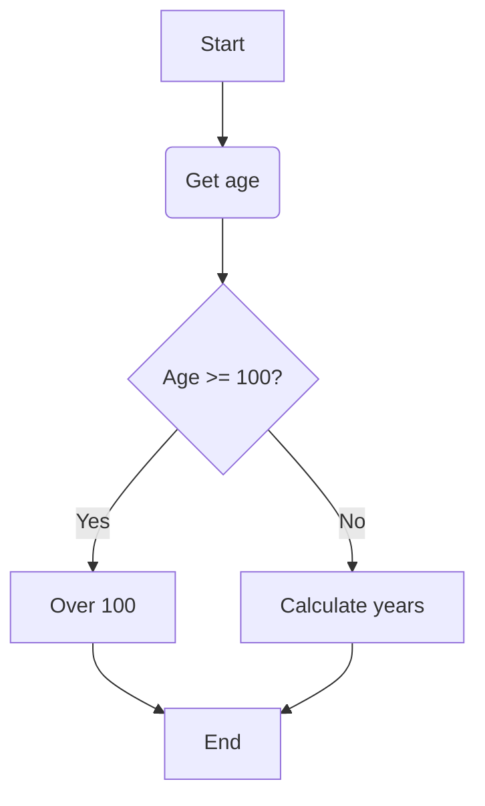
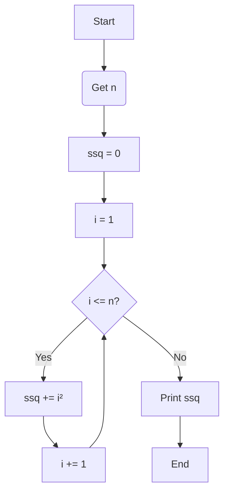
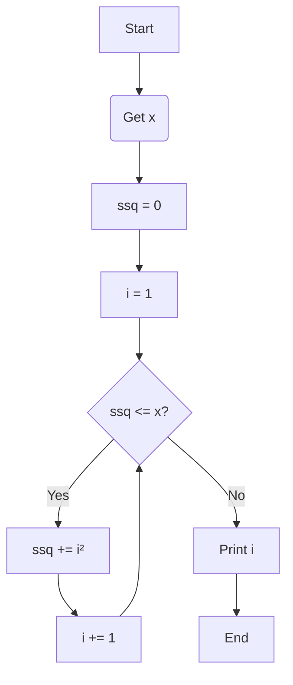
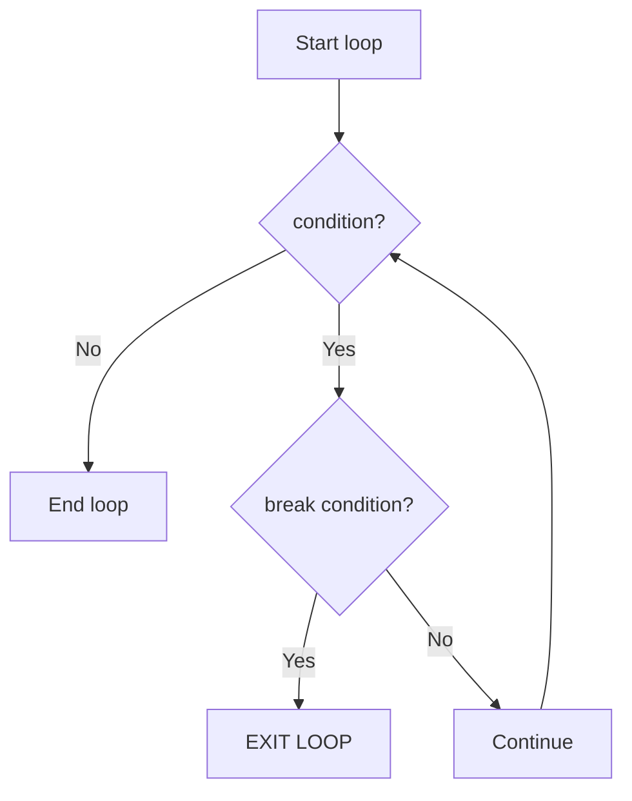
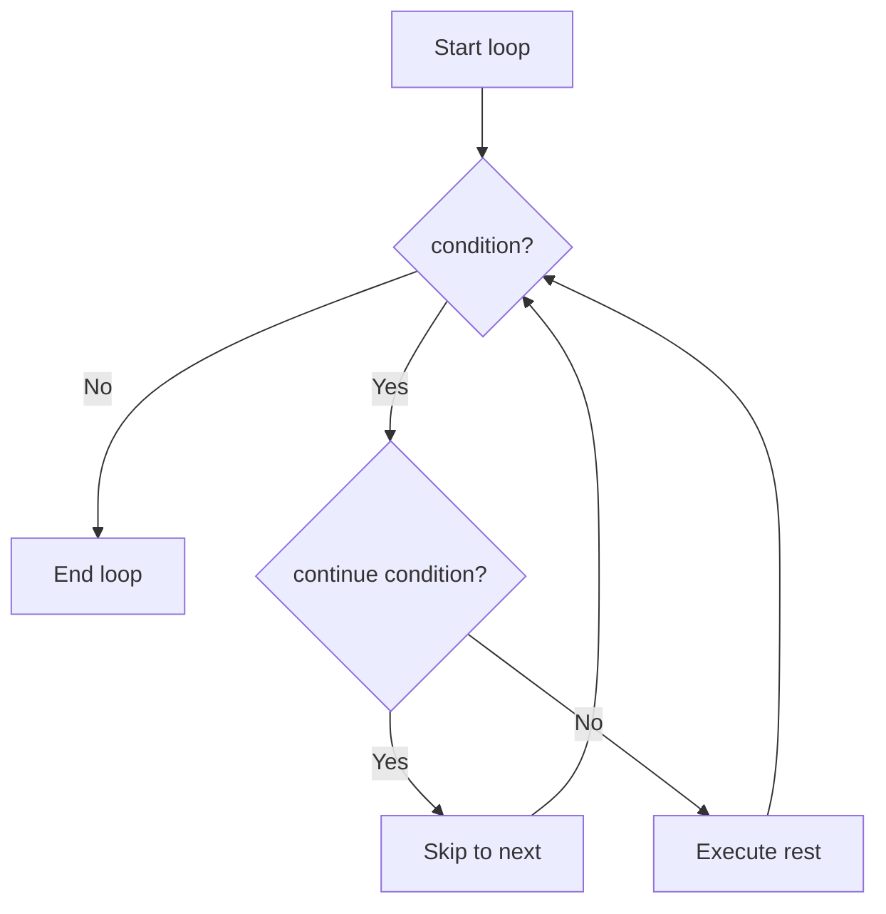

# Day 2: Programming Fundamentals
*PhD Course in Integrative Neurosciences - Introduction to Scientific Programming*
## Overview
Today we understand the foundations of Python programming to explore the core concepts that allow you to write powerful, flexible programs. This lecture covers three fundamental topics:
1. **Variables, Data Structures, and Basic I/O** - How to store and organize data effectively
2. **Operators, Expressions, and Control Structures** - How to manipulate data and control program flow
3. **Functions and Modular Programming** - How to organize code into reusable, maintainable components
By the end of this lecture, you'll have all the essential building blocks needed to write real scientific programs. Every program ever written consists of these components - it's how you combine them that distinguishes well-written, robust code from poorly-written, difficult-to-maintain code.
---
## **Part 1**: Variables, Data Structures, and Basic I/O
### 1.1 Variables 
Variables are named containers that store data. In Python, you don't need to declare variable types explicitly - Python infers the type from the value you assign:
```python
# Basic variable assignment
age = 25                    # integer
temperature = 36.6          # float
name = "Maria"              # string
is_valid = True             # boolean
```
**Variable Naming Rules:**
- Must start with a letter or underscore
- Can contain letters, numbers, and underscores
- Case-sensitive (`age` and `Age` are different variables)
- Cannot use Python keywords (`if`, `for`, `while`, etc.)

> [!info] **Best Practices (PEP 8):**
> - Use lowercase with underscores for variable names: `neuron_count`, `reaction_time`
> - Use descriptive names: `spike_threshold` rather than `st`
> - Avoid single-letter names except for counters (`i`, `j`, `k`)
> 
### 1.2 Basic Data Types
Python provides several built-in data types:
```python
# Numeric types
integer_num = 42                    # int - whole numbers
float_num = 3.14159                 # float - decimal numbers
complex_num = 2 + 3j                # complex - rarely used in basic programming

# Text type
text = "Hello, neuroscience!"       # str - strings

# Boolean type
condition = True                    # bool - True or False (note capitalization)

# None type
empty_value = None                  # NoneType - represents absence of value
```
### 1.3 Type Conversion
You can convert between types using built-in conversion functions:
```python
# String to number
age_str = "25"
age_int = int(age_str)              # Converts to integer
age_float = float(age_str)          # Converts to float

# Number to string
count = 100
count_str = str(count)              # Converts to "100"

# Important: Some conversions may fail
invalid = "hello"
# number = int(invalid)             # This would raise a ValueError!
```
### 1.4 Compound Data Types
Beyond simple types, Python provides structures to store collections of data:
#### Lists: *Ordered, Mutable Collections*
Lists are the most versatile data structure, allowing you to store ordered sequences of items:
```python
# Creating lists
spike_times = [12.3, 15.7, 18.2, 22.1]      # List of floats
brain_regions = ["hippocampus", "cortex", "thalamus"]  # List of strings
mixed_data = [1, "two", 3.0, True]          # Lists can contain mixed types

# Accessing elements (zero-indexed)
first_spike = spike_times[0]                # 12.3
last_region = brain_regions[-1]             # "thalamus" (negative indexing from end)

# Modifying lists
spike_times.append(25.4)                    # Add element to end
spike_times[0] = 10.0                       # Modify element
spike_times.remove(15.7)                    # Remove specific value

# List slicing
first_three = spike_times[0:3]              # Elements 0, 1, 2
last_two = spike_times[-2:]                 # Last two elements
```
#### Tuples: *Ordered, Immutable Collections*
Tuples are like lists but cannot be modified after creation:
```python
# Creating tuples
coordinates = (10.5, 20.3, 30.1)            # Tuple of coordinates
single_item = (42,)                         # Note: comma needed for single item

# Accessing elements (same as lists)
x = coordinates[0]                          # 10.5
y = coordinates[1]                          # 20.3

# Tuples are immutable
# coordinates[0] = 15.0                     # This would raise an error!

# Use tuples when data shouldn't change
electrode_position = (100, 200, 300)        # Position should be fixed
```
#### Dictionaries: *Key-Value Pairs*
Dictionaries store data as key-value pairs, allowing fast lookups:
```python
# Creating dictionaries
experiment_data = {
    "subject_id": "S001",
    "age": 28,
    "condition": "control",
    "score": 85.5
}

# Accessing values by key
subject = experiment_data["subject_id"]     # "S001"
age = experiment_data["age"]                # 28

# Adding or modifying entries
experiment_data["gender"] = "F"             # Add new key-value pair
experiment_data["score"] = 90.0             # Update existing value

# Checking if key exists
if "condition" in experiment_data:
    print(f"Condition: {experiment_data['condition']}")

# Getting all keys and values
keys = experiment_data.keys()               # dict_keys(['subject_id', 'age', ...])
values = experiment_data.values()           # dict_values(['S001', 28, ...])
```
#### Sets: *Unordered, Unique Collections*
Sets store unique values with no duplicates:
```python
# Creating sets
neuron_types = {"pyramidal", "interneuron", "basket"}
spike_counts = {1, 2, 3, 2, 1, 4}          # Duplicates automatically removed → {1, 2, 3, 4}

# Set operations
all_neurons = {"pyramidal", "interneuron", "basket", "chandelier"}
recorded_neurons = {"pyramidal", "interneuron"}

common = all_neurons & recorded_neurons     # Intersection
different = all_neurons - recorded_neurons  # Difference
combined = all_neurons | recorded_neurons   # Union
```
### 1.5 Basic Input and Output
#### Reading User Input
The `input()` function reads text from the user:
```python
# Reading string input
name = input("What is your name? ")
print(f"Hello, {name}!")

# Reading numeric input (requires conversion)
age_str = input("What is your age? ")
age = int(age_str)                          # Convert string to integer

# Modern approach: combine input and conversion
age = int(input("What is your age? "))
```
#### Displaying Output
The `print()` function displays information:
```python
# Basic printing
print("Hello, world!")

# Printing multiple items (separated by space by default)
name = "Ana"
age = 25
print("Name:", name, "Age:", age)           # Name: Ana Age: 25

# Modern f-string formatting (Python 3.6+)
print(f"Name: {name}, Age: {age}")          # Name: Ana, Age: 25

# F-strings with expressions
voltage = 70
print(f"The membrane potential is {voltage}mV")
print(f"Twice the voltage: {voltage * 2}mV")

# Formatting numbers
pi = 3.14159265359
print(f"Pi to 2 decimals: {pi:.2f}")        # Pi to 2 decimals: 3.14
print(f"Pi in scientific notation: {pi:.2e}")  # Pi in scientific notation: 3.14e+00
```
---
## **Part 2**: Operators, Expressions, and Control Structures
### 2.1 Understanding Operators and Expressions
An **operator** is a symbol that performs an operation on one or more **operands** (values or variables). Together, they form an **expression** that evaluates to a result.
![[Pasted image 20251015140201.png]]
Operators can be classified by:
1. **Number of operands**: Unary (one operand), Binary (two operands), Ternary (three operands)
2. **Type of operation**: Arithmetic, Logical, Comparison, etc.
3. **Type of result**: Numeric, Boolean, etc.
### 2.2 Arithmetic Operators
Arithmetic operators perform mathematical operations:

| Operator | Name | Example | Result | Description |
|----------|------|---------|--------|-------------|
| `**` | Power | `2 ** 3` | `8` | Exponentiation |
| `+` | Unary plus | `+5` | `5` | Positive sign |
| `-` | Unary minus | `-5` | `-5` | Negative sign |
| `*` | Multiplication | `4 * 5` | `20` | Multiplication |
| `/` | Division | `7 / 2` | `3.5` | True division (always returns float) |
| `//` | Floor division | `7 // 2` | `3` | Integer division (rounds down) |
| `%` | Modulo | `7 % 3` | `1` | Remainder of division |
| `+` | Addition | `3 + 4` | `7` | Addition |
| `-` | Subtraction | `10 - 3` | `7` | Subtraction |
**Operator Precedence** (highest to lowest):
1. `**` (power)
2. `+`, `-` (unary)
3. `*`, `/`, `//`, `%`
4. `+`, `-` (binary)

```python
# Examples demonstrating precedence
result = 2 + 3 * 4              # 14 (multiplication before addition)
result = (2 + 3) * 4            # 20 (parentheses override precedence)
result = 2 ** 3 ** 2            # 512 (right-to-left: 2 ** (3 ** 2))
result = -5 ** 2                # -25 (unary minus has lower precedence than **)
result = (-5) ** 2              # 25 (parentheses change meaning)
```

**Compound Assignment Operators:**
These operators combine arithmetic operations with assignment:
```python
a = 10
a += 5          # Equivalent to: a = a + 5  → a is now 15
a -= 3          # Equivalent to: a = a - 3  → a is now 12
a *= 2          # Equivalent to: a = a * 2  → a is now 24
a /= 4          # Equivalent to: a = a / 4  → a is now 6.0
a //= 2         # Equivalent to: a = a // 2 → a is now 3.0
a %= 2          # Equivalent to: a = a % 2  → a is now 1.0
a **= 3         # Equivalent to: a = a ** 3 → a is now 1.0
```

### 2.3 Arithmetic Expressions
Operators combine with variables and values to form more complex expressions:
```python
# Scientific example: calculating distance
x1, y1 = 10.0, 20.0
x2, y2 = 30.0, 40.0

# Calculate Euclidean distance
distance = ((x2 - x1) ** 2 + (y2 - y1) ** 2) ** 0.5

# Neuroscience example: calculating firing rate
spike_count = 150
recording_duration = 10.0  # seconds
firing_rate = spike_count / recording_duration  # 15.0 Hz

# Use parentheses for clarity even when not strictly needed
mean = (a + b + c) / 3      # Clear that we're averaging three values
```

> [!info] **Best Practices:**
> - Use spaces around operators for readability: `a + b * c` rather than `a+b*c`
> - Use parentheses to make complex expressions clear
> - Break very long expressions across multiple lines
### 2.4 String Operators
Strings have special operators for concatenation and repetition:
```python
# Concatenation with +
greeting = "Hello" + " " + "world"          # "Hello world"
full_name = "Ana" + " " + "Silva"           # "Ana Silva"

# Repetition with *
separator = "-" * 40                        # "----------------------------------------"
emphasis = "Important! " * 3                # "Important! Important! Important! "

# Modern approach: use f-strings instead of concatenation
first_name = "Ana"
last_name = "Silva"
full_name = f"{first_name} {last_name}"     # Cleaner and more flexible

# F-strings can include expressions
neuron_count = 42
message = f"Recorded {neuron_count} neurons ({neuron_count * 2} electrodes used)"
```
### 2.5 Boolean (Logical) Variables
Boolean variables represent truth values and are essential for decision-making:
```python
# Boolean values (note capitalization - must be True/False, not true/false)
is_active = True
is_inhibited = False

# Comparison operations return booleans
age = 25
is_adult = age >= 18                        # True
is_teenager = 13 <= age < 20                # False

# Use booleans in conditions
if is_active:
    print("Neuron is firing")
```
### 2.6 Comparison Operators
Comparison operators compare values and return boolean results:

| Operator | Name                  | Example  | Result  | Description                    |
| -------- | --------------------- | -------- | ------- | ------------------------------ |
| `<`      | Less than             | `3 < 5`  | `True`  | Left value is smaller          |
| `<=`     | Less than or equal    | `5 <= 5` | `True`  | Left value is smaller or equal |
| `>`      | Greater than          | `3 > 5`  | `False` | Left value is larger           |
| `>=`     | Greater than or equal | `5 >= 3` | `True`  | Left value is larger or equal  |
| ==       | Equal to              | `5 == 5` | `True`  | Values are equal               |
| `!=`     | Not equal to          | `5 != 3` | `True`  | Values are different           |
```python
# Numeric comparisons
voltage = -70
is_resting = voltage == -70                 # True
is_depolarized = voltage > -70              # False
is_hyperpolarized = voltage < -70           # False

# String comparisons (alphabetical/lexicographic order)
"apple" < "banana"                          # True
"Apple" < "apple"                           # True (uppercase comes before lowercase)

# Chained comparisons (very useful!)
age = 25
is_young_adult = 18 <= age < 30             # True - much cleaner than: age >= 18 and age < 30

# Be careful with floating-point comparisons
a = 0.1 + 0.1 + 0.1
b = 0.3
print(a == b)                               # Might be False due to floating-point precision!
print(abs(a - b) < 1e-10)                   # Better approach for floats
```

**Common Pitfall:**
```python
# Don't confuse assignment (=) with comparison (==)
x = 5       # Assignment: set x to 5
x == 5      # Comparison: check if x equals 5

# This is a common error:
if x = 5:   # WRONG! This is a syntax error
    print("x is 5")

if x == 5:  # CORRECT - this compares x to 5
    print("x is 5")
```
### 2.7 Logical Operators
Logical operators combine boolean values:

| Operator | Name | Example | Result | Description |
|----------|------|---------|--------|-------------|
| `not` | Negation | `not True` | `False` | Inverts boolean value |
| `and` | Conjunction | `True and False` | `False` | True only if both operands are True |
| `or` | Disjunction | `True or False` | `True` | True if at least one operand is True |
**Truth Tables:**
```python
# AND truth table
True and True    # True
True and False   # False
False and True   # False
False and False  # False

# OR truth table
True or True     # True
True or False    # True
False or True    # True
False or False   # False

# NOT truth table
not True         # False
not False        # True
```

| Operation | Input 1 | Input 2 | Output |
| --------- | ------- | ------- | ------ |
| AND       | True    | True    | True   |
| AND       | True    | False   | False  |
| AND       | False   | True    | False  |
| AND       | False   | False   | False  |
| OR        | True    | True    | True   |
| OR        | True    | False   | True   |
| OR        | False   | True    | True   |
| OR        | False   | False   | False  |
| NOT       | True    |         | False  |
| NOT       | False   |         | True   |
**Practical Examples:**
```python
# Neuroscience example: check if neuron should fire
voltage = -50
threshold = -55
is_excitatory = True

should_fire = voltage > threshold and is_excitatory  # True

# Multiple conditions
age = 25
has_consent = True
is_healthy = True

can_participate = age >= 18 and has_consent and is_healthy  # True

# Using 'or' for alternatives
response = "y"
is_affirmative = response == "yes" or response == "y" or response == "Y"  # True

# Complex logical expressions
temperature = 37.5
is_fevered = temperature > 37.0
is_medicated = False

needs_attention = (is_fevered and not is_medicated) or temperature > 39.0
```

**Operator Precedence** (all operators, highest to lowest):
1. `**` (power)
2. `+`, `-` (unary)
3. `*`, `/`, `//`, `%`
4. `+`, `-` (binary)
	1. `<`, `<=`, `>`, `>=`, == , `!=` (comparisons)
5. `not`
6. `and`
7. `or`
```python
# Precedence examples
result = 5 + 3 > 7 and 10 < 20          # True (arithmetic, then comparison, then logical)

# Use parentheses for clarity!
result = (5 + 3 > 7) and (10 < 20)      # Same result but much clearer

# Complex expression
i = 0
j = 10
condition = i < j and j >= 5 or i > -1  # True - but hard to read!
condition = ((i < j) and (j >= 5)) or (i > -1)  # Same thing, much clearer
```
### 2.8 Control Structures
Control structures allow programs to make decisions and repeat actions. Without them, programs would be linear - executing every line in order from start to finish.
#### 2.8.1 Branching: The `if` Statement
The `if` statement executes code conditionally based on boolean expressions.

**Basic `if` Structure:**
```python
# Simple if statement
age = 25
if age >= 18:
    print("You are an adult")
    print("You can participate in the study")
# Code continues here regardless
```

**`if-else` Structure:**
```python
# Two alternatives
age = int(input("What is your age? "))

if age >= 100:
    print("You are already over 100!")
else:
    years_to_go = 100 - age
    print(f"You will turn 100 in {years_to_go} years!")
```

**Flowchart representation:**


**`if-elif-else` Structure:**
For multiple conditions, use `elif` (else if):
```python
age = int(input("What is your age? "))

if age > 100:
    print("You are already over 100!")
elif age == 100:
    print("You are exactly 100, congratulations!")
else:
    years_to_go = 100 - age
    print(f"You will turn 100 in {years_to_go} years!")
```

> [!important] **Important Notes:**
> 1. **Indentation is crucial** - Python uses indentation (4 spaces recommended) to define code blocks
> 2. **Colons are required** after conditions
> 3. **Multiple statements** can be in each block
> 4. **elif vs multiple if** - they behave differently:
```python
# Using elif: only one block executes
score = 85
if score >= 90:
    print("Excellent")
elif score >= 80:
    print("Good")          # This prints
elif score >= 70:
    print("Satisfactory")  # This is skipped
# Output: "Good"

# Using multiple if: all matching conditions execute
score = 85
if score >= 90:
    print("Excellent")
if score >= 80:
    print("Good")          # This prints
if score >= 70:
    print("Satisfactory")  # This also prints!
# Output: "Good" and "Satisfactory"
```

**Nested `if` Statements:**
You can nest `if` statements inside each other:
```python
voltage = -60
threshold = -55
refractory = False

if voltage > threshold:
    if not refractory:
        print("Neuron fires!")
        print("Action potential generated")
    else:
        print("In refractory period, cannot fire")
else:
    print("Below threshold, no spike")
```

**Neuroscience Example:**
```python
# Classifying neural response based on firing rate
firing_rate = 45.0  # spikes per second

if firing_rate > 100:
    response_type = "strong"
    print("High frequency response detected")
elif firing_rate > 50:
    response_type = "moderate"
    print("Moderate frequency response")
elif firing_rate > 10:
    response_type = "weak"
    print("Low frequency response")
else:
    response_type = "none"
    print("No significant response")

print(f"Classification: {response_type}")
```

#### 2.8.2 Loops: `for` and `while`
Loops allow you to repeat actions multiple times without writing repetitive code.
#### The `for` Loop
Use `for` loops when you know how many times you want to repeat something, or when iterating through a sequence:

**Basic `for` Loop with `range()`:**
```python
# Print numbers 0 to 4
for i in range(5):
    print(i)
# Output: 0, 1, 2, 3, 4

# range(start, stop, step)
for i in range(1, 11, 1):
    print(i)
# Output: 1, 2, 3, 4, 5, 6, 7, 8, 9, 10 (note: stop is exclusive!)

# Count by twos
for i in range(0, 10, 2):
    print(i)
# Output: 0, 2, 4, 6, 8

# Count backwards
for i in range(10, 0, -1):
    print(i)
# Output: 10, 9, 8, 7, 6, 5, 4, 3, 2, 1
```

**Important:** `range(start, stop, step)` generates numbers from `start` up to **but not including** `stop`.

**Iterating Through Sequences:**
```python
# Iterate through a list
brain_regions = ["hippocampus", "cortex", "cerebellum", "thalamus"]
for region in brain_regions:
    print(f"Analyzing {region}")

# Iterate through a string
sequence = "ACGTACGT"
for nucleotide in sequence:
    print(nucleotide)

# Iterate with index using enumerate()
for index, region in enumerate(brain_regions):
    print(f"Region {index + 1}: {region}")
# Output:
# Region 1: hippocampus
# Region 2: cortex
# Region 3: cerebellum
# Region 4: thalamus
```

**Practical Example - Sum of Squares:**
```python
# Calculate sum of squares from 1 to n
n = int(input("Please enter a number: "))
sum_of_squares = 0

for i in range(1, n + 1):
    sum_of_squares += i ** 2

print(f"The sum of squares up to {n} is {sum_of_squares}")

# Example: if n = 5
# 1² + 2² + 3² + 4² + 5² = 1 + 4 + 9 + 16 + 25 = 55
```

**Flowchart for sum of squares:**


**Nested `for` Loops:**
```python
# Multiplication table
for n in range(1, 4):
    for m in range(1, n + 1):
        result = n ** m
        print(f"{n} to the power of {m} is {result}")
    print("=" * 40)

# Output:
# 1 to the power of 1 is 1
# ========================================
# 2 to the power of 1 is 2
# 2 to the power of 2 is 4
# ========================================
# 3 to the power of 1 is 3
# 3 to the power of 2 is 9
# 3 to the power of 3 is 27
# ========================================
```

#### The `while` Loop
Use `while` loops when you want to repeat something as long as a condition is true:
```python
# Basic while loop structure
while condition:
    # statements to repeat
    # (make sure condition eventually becomes False!)
```

**Example - Find Minimum n:**
```python
# Find minimum n where sum of squares exceeds x
x = int(input("Please enter a number: "))
sum_of_squares = 0
i = 1

while sum_of_squares <= x:
    sum_of_squares += i ** 2
    i += 1

print(f"The minimum n is: {i - 1}")
print(f"Sum of squares: {sum_of_squares}")

# Example: if x = 50
# 1² = 1, 1² + 2² = 5, 1² + 2² + 3² = 14, 1² + 2² + 3² + 4² = 30, 1² + 2² + 3² + 4² + 5² = 55
# Minimum n is 5 (sum = 55, which exceeds 50)
```

**Flowchart for while loop:**

**Practical Example - User Validation:**
```python
# Keep asking until valid input
password = ""
while password != "secret":
    password = input("Enter password: ")
    if password != "secret":
        print("Incorrect password, try again")

print("Access granted!")
```

> [!attention] **Danger: Infinite Loops**
> Make sure your condition eventually becomes `False`, or you'll create an infinite loop:
> ```python
> # DANGER - infinite loop!
> counter = 0
> while counter < 10:
>     print(counter)
>     # Oops! Forgot to increment counter
>     # This loop will never end!
> 
> # CORRECT version:
> counter = 0
> while counter < 10:
>     print(counter)
>     counter += 1  # Don't forget this!
> ```

#### Loop Control: `break` and `continue`
Sometimes you need to exit a loop early or skip certain iterations:

**The `break` Statement:**
Exits the loop immediately, skipping any remaining iterations:
```python
# Search for an element
search_letter = "r"
my_string = "This parrot is dead"

for letter in my_string:
    if letter == search_letter:
        print(f"Found '{search_letter}'!")
        break  # Exit loop once found
else:
    # This executes if loop completes without break
    print(f"'{search_letter}' not found")

# Multiple choice with limited attempts
answer = 0
max_attempts = 3

for attempt in range(max_attempts):
    answer = int(input("Please enter your choice (1, 2, or 3): "))
    
    if 1 <= answer <= 3:
        print(f"Your answer was {answer}")
        break  # Valid answer, exit loop
    else:
        print(f"Invalid choice. {max_attempts - attempt - 1} attempts remaining.")
else:
    print("Too many invalid attempts. Goodbye!")
```

**Flowchart with break:**

**The `continue` Statement:**
Skips the rest of the current iteration and continues with the next one:
```python
# Process only integers from a mixed list
my_list = [1, 6, 8, 12.4, "red", 9]
my_int_list = []
int_sum = 0

for item in my_list:
    if not isinstance(item, int):
        continue  # Skip non-integers
    
    # These lines only execute for integers
    my_int_list.append(item)
    int_sum += item

print(f"Integer list: {my_int_list}")
print(f"Sum: {int_sum}")
# Output:
# Integer list: [1, 6, 8, 9]
# Sum: 24

# Skip negative numbers
for num in range(-5, 6):
    if num < 0:
        continue  # Skip negative numbers
    print(num)
# Output: 0, 1, 2, 3, 4, 5
```

**Flowchart with continue:**


> [!note] **Important Notes:**
> - `break` and `continue` only affect the innermost loop they're in
> - They should always be used with an `if` condition
> - Overuse can make code hard to follow - use judiciously

### 2.9 Exception Handling
Programs often encounter errors (called "exceptions"). Instead of crashing, we can handle these errors gracefully (we will cover this topic in more detail later):
#### Basic `try-except` Structure
```python
# Without exception handling - program crashes
age_str = "twenty-five"
age = int(age_str)  # ValueError: invalid literal for int()
# Program terminates here!

# With exception handling - program continues
age_str = "twenty-five"
try:
    age = int(age_str)
    print(f"Your age is {age}")
except ValueError:
    print("You did not enter a valid number")
    age = None
# Program continues normally
```

**Improved 100th Birthday Program:**
```python
my_age_str = input("What is your age? ")

try:
    my_age = int(my_age_str)
    
    if my_age > 100:
        print("You are already over 100!")
    elif my_age == 100:
        print("You are exactly 100, congratulations!")
    else:
        years_to_go = 100 - my_age
        print(f"You will turn 100 in {years_to_go} years!")
        
except ValueError:
    print("You did not enter a valid number")
```
#### Giving Multiple Chances with `while` and `try-except`
```python
# Keep asking until valid input
while True:
    my_age_str = input("What is your age? ")
    
    try:
        my_age = int(my_age_str)
        break  # Exit loop on successful conversion
    except ValueError:
        print("Invalid input. Please enter a number.")

# Now process the valid age
if my_age > 100:
    print("You are already over 100!")
elif my_age == 100:
    print("You are exactly 100, congratulations!")
else:
    years_to_go = 100 - my_age
    print(f"You will turn 100 in {years_to_go} years!")
```
#### Handling Multiple Exception Types
Different errors can be handled separately:
```python
try:
    numerator = int(input("Please enter the numerator: "))
    denominator = int(input("Please enter the denominator: "))
    
    quotient = numerator / denominator
    print(f"The result of {numerator} / {denominator} is: {quotient}")
    
except ValueError:
    print("Incorrect input - please enter integers only!")
    
except ZeroDivisionError:
    print("You cannot divide by zero!")
    
except Exception as e:
    # Catch any other unexpected errors
    print(f"An unexpected error occurred: {e}")
```

**Common Exception Types:**

| Exception | Description | Example |
|-----------|-------------|---------|
| `ValueError` | Invalid value for operation | `int("hello")` |
| `ZeroDivisionError` | Division by zero | `5 / 0` |
| `TypeError` | Wrong type for operation | `"5" + 5` |
| `NameError` | Variable not defined | Using `count` before defining it |
| `IndexError` | Invalid index for sequence | `my_list[100]` on short list |
| `KeyError` | Invalid key for dictionary | `my_dict["nonexistent"]` |
| `FileNotFoundError` | File doesn't exist | Opening non-existent file |
| `IOError` | Input/output operation failed | Reading from closed file |

**The `try-except-else-finally` Structure:**
```python
try:
    # Code that might raise an exception
    file_content = open("data.txt").read()
    value = int(file_content)
    
except FileNotFoundError:
    # Executes if file not found
    print("Data file not found")
    value = 0
    
except ValueError:
    # Executes if content isn't a valid integer
    print("File contains invalid data")
    value = 0
    
else:
    # Executes only if NO exception occurred
    print(f"Successfully read value: {value}")
    
finally:
    # ALWAYS executes, whether exception occurred or not
    # Useful for cleanup (closing files, connections, etc.)
    print("Finished processing")
```
### 2.10 Importing Modules
Python's standard library and third-party packages provide powerful functionality. Use `import` to access them:
#### Import Methods
**1. Import entire module:**
```python
import numpy

# Use functions with module prefix
array = numpy.arange(0.0, 10.0, 0.5)
mean_value = numpy.mean(array)
```

**2. Import with alias (recommended):**
```python
import numpy as np

# Use shorter alias
array = np.arange(0.0, 10.0, 0.5)
mean_value = np.mean(array)

# Standard aliases in scientific Python:
import numpy as np
import pandas as pd
import matplotlib.pyplot as plt
```

**3. Import specific functions:**
```python
from numpy import arange, mean, std

# Use functions directly (no prefix needed)
array = arange(0.0, 10.0, 0.5)
mean_value = mean(array)
std_value = std(array)
```

**4. Import everything (NOT recommended):**
```python
from numpy import *

# Can use all numpy functions without prefix
# BUT: risk of name conflicts, hard to track where functions come from
array = arange(0.0, 10.0, 0.5)
```

**Practical Example:**
```python
import numpy as np

# Create an array of floats (range() only works with integers)
spike_times = np.arange(10.0, 20.0, 0.1)

# Calculate statistics
mean_time = np.mean(spike_times)
std_time = np.std(spike_times)

print(f"Spike times from {spike_times[0]} to {spike_times[-1]} ms")
print(f"Mean: {mean_time:.2f} ms, SD: {std_time:.2f} ms")
```

**Common Scientific Modules:** A lot of your programs will start with these imports
```python
# Numerical computing
import numpy as np

# Data analysis and manipulation
import pandas as pd

# Plotting and visualization
import matplotlib.pyplot as plt

# Scientific computing (statistics, optimization, etc.)
import scipy
from scipy import stats

# Machine learning
import sklearn
```
---
## **Part 3**: Functions and Modular Programming
### 3.1 What is a Function?
A **function** is a named block of reusable code that performs a specific task. Functions are the key to writing maintainable, understandable programs.

**Anatomy of a function:**
```python
def function_name(parameters):
    """
    Docstring: describes what the function does.
    This is optional but highly recommended.
    """
    # Function body - the code that executes
    statement1
    statement2
    
    return result  # Optional - returns a value
```

**Simple Example:**
```python
def greet(name):
    """Return a personalized greeting."""
    greeting = f"Hello, {name}!"
    print(greeting)
    print("It's nice to meet you")
    return greeting

# Call the function
message = greet("Ana")
# Output:
# Hello, Ana!
# It's nice to meet you
```
### 3.2 Why Use Functions?
Functions provide several critical benefits:
#### 1. Avoid Repetition (DRY Principle: Don't Repeat Yourself)
```python
# WITHOUT functions - repetitive and error-prone
print("Hello Abel")
print("It's nice to meet you")
print()
print("Hello Baker")
print("It's nice to meet you")
print()
print("Hello Charlie")
print("It's nice to meet you")

# WITH functions - clean and maintainable
def greet(name):
    print(f"Hello {name}")
    print("It's nice to meet you")
    print()

for person in ["Abel", "Baker", "Charlie"]:
    greet(person)
```
#### 2. Make Code More Readable
```python
# Hard to understand
data = [45, 52, 48, 51, 49, 55, 47]
result = sum(data) / len(data)
variance = sum((x - result) ** 2 for x in data) / len(data)
final = variance ** 0.5

# Clear and self-documenting
def calculate_mean(data):
    """Calculate the mean of a list of numbers."""
    return sum(data) / len(data)

def calculate_std(data):
    """Calculate the standard deviation of a list of numbers."""
    mean = calculate_mean(data)
    variance = sum((x - mean) ** 2 for x in data) / len(data)
    return variance ** 0.5

data = [45, 52, 48, 51, 49, 55, 47]
mean = calculate_mean(data)
std = calculate_std(data)
```
#### 3. Make Code Easier to Share and Reuse
Functions can be collected into modules and shared:
```python
# In file: neuroscience_utils.py
def calculate_firing_rate(spike_count, duration):
    """Calculate firing rate in Hz."""
    return spike_count / duration

def calculate_cv(isi_values):
    """Calculate coefficient of variation for inter-spike intervals."""
    mean_isi = sum(isi_values) / len(isi_values)
    std_isi = (sum((x - mean_isi) ** 2 for x in isi_values) / len(isi_values)) ** 0.5
    return std_isi / mean_isi

# In your analysis script:
from neuroscience_utils import calculate_firing_rate, calculate_cv

firing_rate = calculate_firing_rate(spike_count=150, duration=10.0)
```
### 3.3 Function Naming and Size
**Good Function Names:**
- Describe what the function does: `calculate_distance`, `get_user_input`, `is_valid`, `convert_to_celsius`
- Use verb-noun format: `load_data`, `save_results`, `plot_histogram`
- Follow PEP 8: lowercase with underscores

**How Much Code in a Function?**
A function should do **one thing** and do it well. If you can't easily name the function or describe what it does in one sentence, it probably does too much.
```python
# TOO BROAD - does multiple unrelated things
def analyze_everything(data):
    """This function loads data, processes it, analyzes it, and saves results."""
    # 200 lines of code doing many different things...
    pass

# BETTER - separate focused functions
def load_spike_data(filename):
    """Load spike time data from CSV file."""
    pass

def calculate_firing_rates(spike_times):
    """Calculate firing rates from spike times."""
    pass

def plot_rate_histogram(firing_rates):
    """Plot histogram of firing rates."""
    pass

def save_analysis_results(results, filename):
    """Save analysis results to JSON file."""
    pass
```

**Important:** In Python, functions must be defined **before** they are called:
```python
# WRONG - NameError
greet("Ana")  # Function not yet defined!

def greet(name):
    print(f"Hello, {name}")

# CORRECT
def greet(name):
    print(f"Hello, {name}")

greet("Ana")  # Now it works
```
### 3.4 Function Parameters and Arguments
**Terminology:**
- **Parameters**: Variables listed in the function definition
- **Arguments**: Actual values passed when calling the function

```python
def calculate_distance(x1, y1, x2, y2):  # x1, y1, x2, y2 are parameters
    """Calculate Euclidean distance between two points."""
    return ((x2 - x1) ** 2 + (y2 - y1) ** 2) ** 0.5

# 10, 20, 30, 40 are arguments
distance = calculate_distance(10, 20, 30, 40)
```
#### Positional Arguments
Arguments are matched to parameters by position:
```python
def describe_neuron(name, region, neuron_type, count):
    """Describe a neuron population."""
    print(f"Neuron: {name}")
    print(f"Brain region: {region}")
    print(f"Type: {neuron_type}")
    print(f"Count: {count}")

# Arguments matched by position
describe_neuron("Cell-001", "hippocampus", "pyramidal", 150)
# name = "Cell-001", region = "hippocampus", etc.

# WRONG ORDER = WRONG RESULTS
describe_neuron(150, "pyramidal", "hippocampus", "Cell-001")
# name = 150 (wrong!), region = "pyramidal" (wrong!), etc.
```

#### Keyword Arguments
You can specify which parameter each argument goes to:
```python
# Using keyword arguments - order doesn't matter
describe_neuron(
    name="Cell-001",
    neuron_type="pyramidal",
    count=150,
    region="hippocampus"
)

# Mix positional and keyword (positional must come first!)
describe_neuron("Cell-001", "hippocampus", neuron_type="pyramidal", count=150)
```
#### Default Parameter Values
Parameters can have default values for common cases:
```python
def analyze_spike_train(spike_times, bin_size=1.0, window=None):
    """
    Analyze spike train data.
    
    Parameters:
    -----------
    spike_times : list
        List of spike times in seconds
    bin_size : float, optional
        Size of bins for histogram (default: 1.0 second)
    window : tuple, optional
        (start, end) time window to analyze (default: use all data)
    """
    if window is None:
        window = (min(spike_times), max(spike_times))
    
    # Analysis code here...
    print(f"Analyzing {len(spike_times)} spikes")
    print(f"Bin size: {bin_size} s")
    print(f"Window: {window[0]:.2f} to {window[1]:.2f} s")

# Use default values
analyze_spike_train([0.1, 0.5, 1.2, 2.3, 3.1])

# Override bin_size only
analyze_spike_train([0.1, 0.5, 1.2, 2.3, 3.1], bin_size=0.5)

# Override both defaults
analyze_spike_train([0.1, 0.5, 1.2, 2.3, 3.1], bin_size=0.5, window=(0, 2.0))
```

**Rules for default parameters:**
- Must come after required parameters
- Evaluated once when function is defined (watch out with mutable defaults!)
- Use `None` as default for mutable types (lists, dicts):
```python
# DANGER - mutable default parameter!
def add_spike(spike_time, spike_list=[]):  # BAD!
    spike_list.append(spike_time)
    return spike_list

# Each call shares the same list!
spikes1 = add_spike(1.0)  # [1.0]
spikes2 = add_spike(2.0)  # [1.0, 2.0] - unexpected!

# CORRECT - use None
def add_spike(spike_time, spike_list=None):  # GOOD
    if spike_list is None:
        spike_list = []
    spike_list.append(spike_time)
    return spike_list

spikes1 = add_spike(1.0)  # [1.0]
spikes2 = add_spike(2.0)  # [2.0] - correct!
```
#### Variable Number of Arguments
Sometimes you don't know how many arguments you'll receive:
```python
# *args collects extra positional arguments into a tuple
def calculate_mean(*values):
    """Calculate mean of any number of values."""
    if len(values) == 0:
        return 0
    return sum(values) / len(values)

mean1 = calculate_mean(5, 10, 15)           # 10.0
mean2 = calculate_mean(1, 2, 3, 4, 5)       # 3.0
mean3 = calculate_mean(42)                   # 42.0

# **kwargs collects extra keyword arguments into a dictionary
def create_neuron_record(neuron_id, region, **properties):
    """Create a neuron record with flexible properties."""
    record = {
        "id": neuron_id,
        "region": region
    }
    # Add all extra properties
    record.update(properties)
    return record

neuron1 = create_neuron_record("N001", "cortex", 
                                cell_type="pyramidal", 
                                layer="V",
                                firing_rate=45.2)

print(neuron1)
# {'id': 'N001', 'region': 'cortex', 'cell_type': 'pyramidal', 
#  'layer': 'V', 'firing_rate': 45.2}
```
### 3.5 Returning Values
Functions can return values using the `return` statement:
```python
def calculate_membrane_potential(current, resistance):
    """Calculate membrane potential using Ohm's law."""
    voltage = current * resistance
    return voltage

# Use returned value
v = calculate_membrane_potential(current=0.5, resistance=100)
print(f"Membrane potential: {v} mV")
```
#### Multiple Return Values
Python allows returning multiple values (actually returns a tuple):
```python
def calculate_statistics(data):
    """Calculate mean and standard deviation."""
    n = len(data)
    mean = sum(data) / n
    variance = sum((x - mean) ** 2 for x in data) / n
    std = variance ** 0.5
    return mean, std  # Returns a tuple

# Unpack returned values
avg, sd = calculate_statistics([45, 52, 48, 51, 49])
print(f"Mean: {avg:.2f}, SD: {sd:.2f}")

# Or capture as tuple
stats = calculate_statistics([45, 52, 48, 51, 49])
print(f"Results: {stats}")  # (49.0, 2.449...)
```
#### Returning Different Types
Functions can return any Python object:
```python
# Return boolean
def is_spiking(voltage, threshold=-55.0):
    """Check if voltage exceeds threshold."""
    return voltage > threshold

# Return list
def filter_spikes(spike_times, start, end):
    """Return spikes within time window."""
    return [t for t in spike_times if start <= t <= end]

# Return dictionary
def create_trial_data(trial_id, reaction_time, correct):
    """Create trial data dictionary."""
    return {
        "trial": trial_id,
        "rt": reaction_time,
        "correct": correct,
        "timestamp": "2025-01-15"
    }

# Return None (implicitly - no return statement)
def print_summary(data):
    """Print data summary (returns None)."""
    print(f"Number of trials: {len(data)}")
    print(f"Mean RT: {sum(data) / len(data):.2f}")
    # No return statement - implicitly returns None
```

#### Early Returns
The `return` statement immediately exits the function:
```python
def validate_age(age):
    """Validate age input."""
    if age < 0:
        print("Error: Age cannot be negative")
        return False  # Exit here if invalid
    
    if age > 120:
        print("Error: Age seems unrealistic")
        return False  # Exit here if invalid
    
    print("Age is valid")
    return True  # Only reached if all checks pass

# The rest of function after return is never executed
def example():
    return 42
    print("This never prints!")  # Dead code!
```
### 3.6 Passing Functions as Arguments
Functions are objects in Python - you can pass them to other functions:
```python
def rectangle_area(height, width):
    """Calculate rectangle area."""
    return height * width

def triangle_area(height, width):
    """Calculate triangle area."""
    return 0.5 * height * width

def circle_area(radius):
    """Calculate circle area."""
    return 3.14159 * radius ** 2

def calculate_total_area(shape_function, dimensions):
    """
    Calculate total area for multiple shapes.
    
    Parameters:
    -----------
    shape_function : function
        Function to calculate area (must accept 2 parameters)
    dimensions : list of tuples
        List of (height, width) tuples
    """
    total = 0
    for dim in dimensions:
        total += shape_function(dim[0], dim[1])
    return total

# Pass different functions to same code
rectangles = [(4, 5), (2, 1), (1, 10)]
triangles = [(4, 5), (2, 1), (1, 10)]

rect_area = calculate_total_area(rectangle_area, rectangles)    # 32
tri_area = calculate_total_area(triangle_area, triangles)        # 16

print(f"Total rectangle area: {rect_area}")
print(f"Total triangle area: {tri_area}")
```

**Returning Functions:**
```python
def get_area_function(shape):
    """Return the appropriate area calculation function."""
    if shape == "rectangle":
        return rectangle_area
    elif shape == "triangle":
        return triangle_area
    else:
        return None

# Get and use the appropriate function
shape_type = "rectangle"
area_func = get_area_function(shape_type)

if area_func is not None:
    area = area_func(4, 5)
    print(f"{shape_type} area: {area}")
```
### 3.7 Scope and Namespace
**Scope** determines where variables are accessible in your code. Python has several levels of scope:
1. **Local scope** - inside a function
2. **Global scope** - at the module level
3. **Built-in scope** - Python's built-in names

```python
# Global scope
global_var = "I'm global"
count = 0

def my_function():
    # Local scope
    local_var = "I'm local"
    count = 10  # This is a NEW local variable, doesn't affect global count!
    
    print(global_var)   # Can read global variables
    print(local_var)    # Can read local variables
    print(count)        # Prints local count (10)

my_function()
print(global_var)       # Works - global
# print(local_var)      # ERROR - local_var doesn't exist here!
print(count)            # Prints global count (0) - unchanged!
```

**The LEGB Rule** - Python searches for names in this order:
1. **L**ocal - inside current function
2. **E**nclosing - inside enclosing functions
3. **G**lobal - at module level
4. **B**uilt-in - Python built-in names

```python
x = "global x"

def outer():
    x = "outer x"
    
    def inner():
        x = "inner x"
        print(x)  # Prints "inner x" (Local)
    
    inner()
    print(x)      # Prints "outer x" (Enclosing)

outer()
print(x)          # Prints "global x" (Global)

# Built-in example
print(len([1, 2, 3]))  # len is a built-in function
```

**Modifying Global Variables:**
```python
count = 0

def increment():
    global count  # Declare we want to modify global count
    count += 1

print(count)      # 0
increment()
print(count)      # 1
increment()
print(count)      # 2

# WITHOUT global keyword:
def bad_increment():
    count += 1    # ERROR! count not defined locally

# This raises: UnboundLocalError
```

**Best Practice:** Avoid modifying global variables - use function parameters and return values instead:
```python
# BAD - modifies global
count = 0
def increment():
    global count
    count += 1

# GOOD - uses parameters and return
def increment(count):
    return count + 1

count = 0
count = increment(count)  # Clear that count is being updated
```

**Warning about Namespace Pollution:**
```python
# Be careful with variable names in different scopes
data = [1, 2, 3, 4, 5]

def process_data():
    # This creates a NEW local variable, doesn't use global!
    data = []  
    for i in range(10):
        data.append(i * 2)
    return data

result = process_data()
print(data)      # Still [1, 2, 3, 4, 5] - global unchanged
print(result)    # [0, 2, 4, 6, 8, 10, 12, 14, 16, 18] - local version
```
### 3.8 Recursive Functions
A **recursive function** calls itself to solve smaller versions of the same problem:
```python
def factorial(n):
    """
    Calculate factorial of n using recursion.
    n! = n × (n-1) × (n-2) × ... × 2 × 1
    """
    # Base case - stop recursion
    if n <= 1:
        return 1
    
    # Recursive case - call itself with smaller problem
    return n * factorial(n - 1)

print(factorial(5))  # 5! = 5 × 4 × 3 × 2 × 1 = 120

# How it works:
# factorial(5) = 5 * factorial(4)
#              = 5 * (4 * factorial(3))
#              = 5 * (4 * (3 * factorial(2)))
#              = 5 * (4 * (3 * (2 * factorial(1))))
#              = 5 * (4 * (3 * (2 * 1)))
#              = 120
```

**Critical:** Always include a **base case** to stop recursion:
```python
# DANGER - no base case!
def bad_countdown(n):
    print(n)
    return bad_countdown(n - 1)  # Never stops!

# CORRECT - has base case
def good_countdown(n):
    if n <= 0:
        print("Done!")
        return
    print(n)
    good_countdown(n - 1)

good_countdown(5)
# Output: 5, 4, 3, 2, 1, Done!
```

**Practical Example - Fibonacci Sequence:**
```python
def fibonacci(n):
    """
    Calculate the nth Fibonacci number.
    Sequence: 0, 1, 1, 2, 3, 5, 8, 13, 21...
    """
    if n <= 0:
        return 0
    elif n == 1:
        return 1
    else:
        return fibonacci(n - 1) + fibonacci(n - 2)

for i in range(10):
    print(f"F({i}) = {fibonacci(i)}")
```

**When to Use Recursion:**
- ✅ Naturally recursive problems (trees, nested structures)
- ✅ Divide-and-conquer algorithms
- ✅ When code is clearer with recursion
- ❌ Simple loops are usually better for simple iteration
- ❌ Deep recursion can cause stack overflow errors
---
## Summary and Key Takeaways

> [!summary] **Variables and Data Structures**
> - Variables store data and don't need explicit type declaration
> - Basic types: `int`, `float`, `str`, `bool`, `None`
> - Collections: `list` (mutable), `tuple` (immutable), `dict` (key-value), `set` (unique values)
> - Use `input()` for user inpVariables and Data Structures
> - Variables store data and don't need explicit type declaration
> - Basic types: `int`, `float`, `str`, `bool`, `None`
> - Collections: `list` (mutable), `tuple` (immutable), `dict` (key-value), `set` (unique values)
> - Use `input()` for user input, `print()` for output, f-strings for formatting
> ut, `print()` for output, f-strings for formatting

> [!summary] **Operators and Expressions**
> - **Arithmetic:** `+`, `-`, `*`, `/`, `//`, `%`, `**`
> - **Comparison:** `<`, `<=`, `>`, `>=`, == , `!=`
> - **Logical:** `and`, `or`, `not`
> - **Precedence:** arithmetic → comparison → logical (use parentheses for clarity!)


> [!summary] **Control Structures**
> - **`if-elif-else`:** Make decisions based on conditions
> - **`for` loops:** Iterate a known number of times or through sequences
> - **`while` loops:** Repeat while condition is true
> - **`break`:** Exit loop early
> - **`continue`:** Skip to next iteration
> - **Always watch for:** proper indentation, infinite loops, off-by-one errors

> [!summary] **Exception Handling**
> - Use `try-except` blocks to handle errors gracefully
> - Handle specific exception types separately
> - Common exceptions: `ValueError`, `ZeroDivisionError`, `TypeError`, `NameError`

> [!summary] **Functions**
> - **Define:** `def function_name(parameters):`
> - **Benefits:** Avoid repetition, improve readability, enable reuse
> - **Parameters:** Positional, keyword, default values, `*args`, `**kwargs`
> - **Return:** Use `return` to send values back
> - **Scope:** Local vs. global - be mindful of variable accessibility
> - **Recursion:** Functions can call themselves (need base case!)

> [!important] **Best Practices**
> 1. Use descriptive variable and function names
> 2. Follow PEP 8 style guidelines (4-space indentation, lowercase_with_underscores)
> 3. Write docstrings for functions
> 4. Keep functions focused on one task
> 5. Use comments to explain *why*, not *what*
> 6. Handle errors with try-except blocks
> 7. Test your code with different inputs
> 
---
## Simple Practice Exercises 

### Exercise 1: Temperature Converter
Write a program that:
1. Asks the user for a temperature
2. Asks whether it's in Celsius or Fahrenheit
3. Converts to the other unit and displays the result
4. Handles invalid input gracefully

Formulas:
- °F = (°C × 9/5) + 32
- °C = (°F - 32) × 5/9

### Exercise 2: Spike Rate Analysis
Write a function `analyze_spike_train(spike_times, duration)` that:
1. Takes a list of spike times (in seconds) and recording duration
2. Calculates firing rate (spikes/second)
3. Calculates inter-spike intervals (ISI)
4. Returns mean ISI and coefficient of variation (CV = std/mean)

### Exercise 3: Data Filtering
Write a function that takes a list of experimental measurements and:
1. Removes outliers (values > 3 standard deviations from mean)
2. Returns cleaned data and number of outliers removed
3. Handles empty lists gracefully

### Exercise 4: Recursive List Sum
Write a recursive function to sum all numbers in a nested list:
```python
# Example: [1, [2, 3], [[4], 5]] should return 15
```
---
## Additional Resources

**Official Python Documentation:**
- Python Tutorial: https://docs.python.org/3/tutorial/
- Built-in Functions: https://docs.python.org/3/library/functions.html
- PEP 8 Style Guide: https://pep8.org/

**Learning Resources:**
- Real Python: https://realpython.com/
- Python for Scientists: https://scipy-lectures.org/
- Python Data Science Handbook: https://jakevdp.github.io/PythonDataScienceHandbook/

**Practice:**
- Python Challenge: http://www.pythonchallenge.com/
- HackerRank: https://www.hackerrank.com/domains/python
- Project Euler: https://projecteuler.net/
---
*This handout accompanies the "Introduction to Scientific Programming" course at the Center for Neuroscience and Cell Biology, University of Coimbra. It provides comprehensive coverage of programming fundamentals but is not intended as a standalone introduction to Python. For complete beginners, we recommend supplementing with additional resources and hands-on practice.*

*Updated for Python 3.8+ with modern best practices | January 2025*
